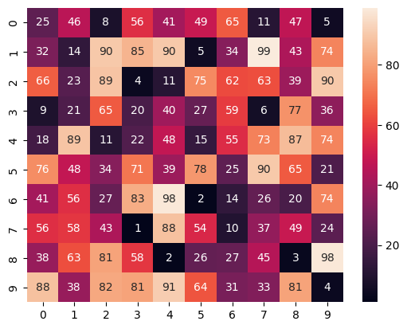
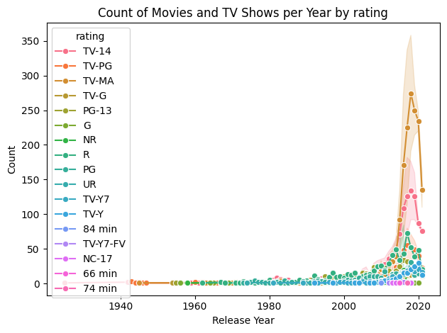

# 🎨 Seaborn Visuals: Data Never Looked So Good

> **Elegant, expressive, and ready to impress. A collection of stunning statistical visualizations powered by [Seaborn](https://seaborn.pydata.org/) and Python.**


---

## ✨ About

This project brings data to life with Seaborn—Python's slickest statistical visualization library.  
From bar plots to violin plots, heatmaps to pairplots, you'll find beautiful, customizable, and insightful charts to kickstart your data storytelling journey.

---

## 🖼️ Gallery

> *A taste of what you'll create:*

<p align="center">
  
  
  
  
  
</p>

---

## 🚀 Features

- Gorgeous, out-of-the-box plots across **15 plot types**
- Custom color palettes (`palette="GnBu"`, `palette="pastel"`, and more!)
- Interactive Jupyter notebooks for quick experimentation
- Clean, readable Python code with comments
- **Interactive Streamlit app** with live charts & a full image gallery
- Ready to use with your own data

---

## 🖥️ Streamlit App

An interactive, multi-page app that lets you explore every plot type with live controls.

### ▶️ Quick Start

```bash
cd Streamlit
pip install -r requirements.txt
streamlit run app.py
```

### 📑 App Pages

| Page | Description |
|------|-------------|
| 🏠 **Home** | Hero banner, metrics overview, and visualization roadmap |
| 📊 **Distribution Plots** | Histogram, KDE, Boxplot, Violin — with interactive controls |
| 📈 **Categorical Plots** | Bar, Count, Strip, Swarm — category comparisons |
| 🔗 **Relational Plots** | Scatterplot, Lineplot, Heatmap — relationships & correlations |
| 🎨 **Advanced Plots** | CatPlot, Pair Plot, FacetGrid, Styling — grids & themes |
| 🖼️ **Gallery** | Browse all 120+ notebook output images by plot type |

### ✨ App Highlights

- **Live interactive charts** — tweak parameters in real-time
- **Dataset selector** — switch between tips, iris, penguins, and more
- **Code snippets** — see the exact Seaborn code for every chart
- **Notebook output gallery** — browse original PNGs from notebooks
- **Premium dark UI** — coral/orange-teal gradient theme

---

## 📦 Getting Started

1. **Clone the repo**
    ```bash
    git clone https://github.com/yourusername/seaborn-visuals.git
    cd seaborn-visuals
    ```

2. **Install requirements**
    ```bash
    pip install -r requirements.txt
    ```

3. **Launch the Jupyter notebooks**
    ```bash
    jupyter notebook
    ```

---

## 📂 Project Structure

```
seaborn/
├── Readme.md
├── Bar Plot/            ← 12 chart outputs + notebook
├── Boxplot/             ← 10 chart outputs + notebook
├── CatPlot/             ← 8 chart outputs + notebook
├── CountPlot/           ← 6 chart outputs + notebooks
├── FacetGrid/           ← 10 chart outputs + notebook
├── Heatmap/             ← 6 chart outputs + notebook
├── Histogram/           ← 8 chart outputs + notebook
├── KDE Plot/            ← 8 chart outputs + notebook
├── Lineplot/            ← 5 chart outputs + notebook + data
├── Pair Plot/           ← 6 chart outputs + notebook
├── Scatterplots/        ← 8 chart outputs + notebook
├── Strip plot/          ← 6 chart outputs + notebook
├── Styling the plots/   ← 8 chart outputs + notebook
├── Swarm Plot/          ← 6 chart outputs + notebook
├── Violin Plot/         ← 6 chart outputs + notebook
└── Streamlit/           ← Interactive web app
    ├── app.py           ← Main entry point
    ├── requirements.txt
    ├── utils/
    │   ├── styles.py    ← Premium CSS theme
    │   └── helpers.py   ← Shared utilities
    └── pages/
        ├── 01_📊_Distribution_Plots.py
        ├── 02_📈_Categorical_Plots.py
        ├── 03_🔗_Relational_Plots.py
        ├── 04_🎨_Advanced_Plots.py
        └── 05_🖼️_Gallery.py
```

---

## 🛠️ Tech Stack

| Tool | Purpose |
|------|---------|
| [Seaborn](https://seaborn.pydata.org/) | Statistical visualization |
| [Matplotlib](https://matplotlib.org/) | Low-level plotting backend |
| [Pandas](https://pandas.pydata.org/) | Data manipulation |
| [Streamlit](https://streamlit.io/) | Interactive web app |
| [Jupyter Notebook](https://jupyter.org/) | Exploration & prototyping |

---

## 💡 Usage

Explore the sample notebooks and PNGs to see what Seaborn can do.  
Tweak the code, change the palette, or try your own dataset—just have fun!

---

## 🙌 Contributing

Pull requests are welcome! For major changes, please open an issue first to discuss what you'd like to change.

---

## 📄 License

[MIT](LICENSE)

---

> **Let your data speak. Make it look amazing. Seaborn FTW.**
